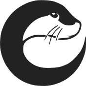

Otterworld

============

Projet d'imitation de LeBonCoin avec le framework Symfony, en utilisant le moteur de template Twig et le système de gestion de base de données MySQL. Le tout sur une stack Docker.

L'entièreté des articles étant évidemment remplacés par des loutres.

Le site est hébergé sur un serveur custom, et est accessible à l'adresse suivante : https://projet.domino659.com/


<br>

# Installation
## Php-fpm-alpine x Nginx
### Symfony | Docker

Avec MariaDB

Pour lancer le projet :
````shell
docker-compose up -d
docker exec symfony_docker composer create-project symfony/skeleton html
sudo chown -R $USER ./
````

Pensez ensuite à aller exécuter toutes vos commandes depuis l'intérieur du container.  
(Demandez à Composer de NE PAS créer une config Docker pour la database)

Enfin, modifiez la config DB dans le fichier .env de Symfony :
````shell
DATABASE_URL=mysql://root:flamingo@db:3306/symfony_db?serverVersion=mariadb-10.7.1
````

### Générer les données :
Toujours depuis l \'intérieur du container:
````shell
symfony console doctrine:fixtures:load
````

La plupart des comptes seront aléatoires, mais vous pouvez vous connecter avec :
````shell
User Account  
mail: user@gmail.com  
pswd: password

Admin Account  
mail: admin@gmail.com  
pswd: password
````